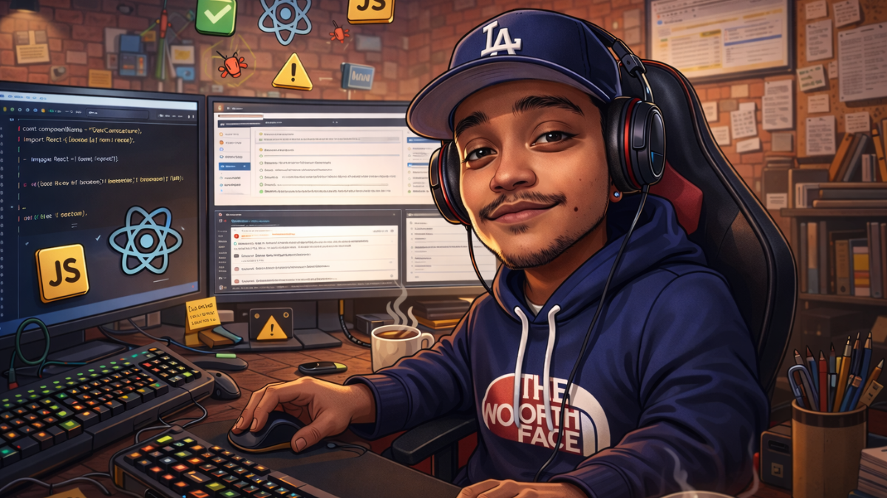

#  Hi! I'm Jules 👋

### Main Skills

### About Me

I am a Software Management and Development Engineer with a solid background in technology development since 2017, although my curiosity about how things work and my passion for building solutions started much earlier. I have always been driven by the desire to understand, create, and continuously improve.

I am currently part of the team at VLIM, a company focused on transforming ideas into customized digital solutions — from mobile applications to web systems and e-commerce platforms — helping businesses grow and digitally transform through efficient, tailor-made technology.

I specialize in mobile application development and robust software engineering, and I am passionate about constantly improving my skills, particularly in areas such as clean code, design patterns, and high-quality engineering practices. I enjoy tackling technical challenges with a practical and creative mindset, always aiming to optimize processes and deliver real value.

Beyond programming, I enjoy listening to music, reading books, and playing video games — activities that help me stay mentally active, balanced, and open to new ideas. My professional and personal goal is to learn and teach — not only to write good code, but to share knowledge so others can grow as well. I strive to work efficiently, quickly, and collaboratively, contributing meaningful value to any team I am part of.

### My Stats

